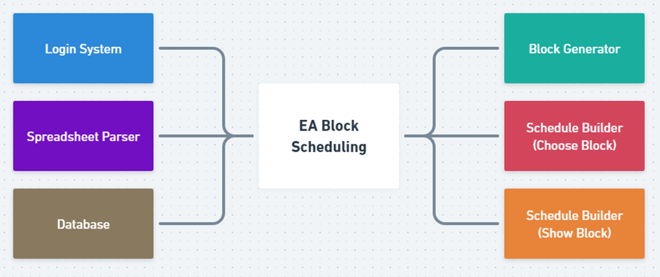
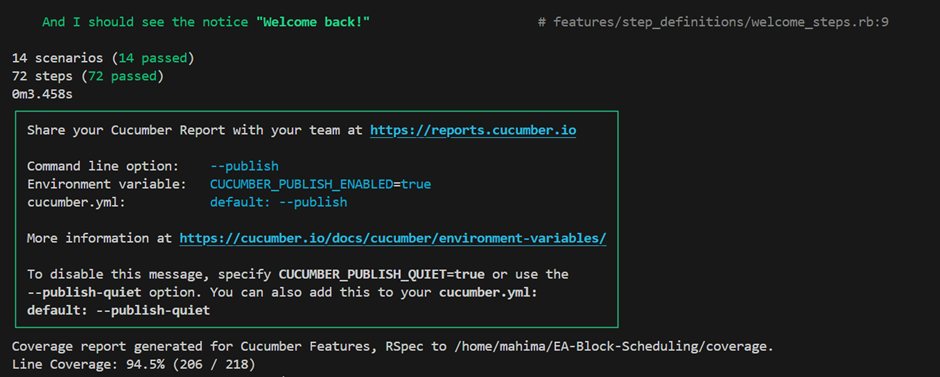
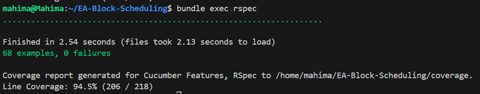

Sprint 3 Retrospective
1. Deployed App
Taiga (project page): https://tree.taiga.io/project/aaronjones05-block-scheduler/wiki/home
Github Repo: https://github.com/tamu-edu-students/EA-Block-Scheduling
Deployed App: https://ea-block-scheduler-4fecd886e389.herokuapp.com/
2. Dates of the Sprint
25 Oct 2024 to 08 Nov 2024
3. Information about Team and Member Contributions

 
4. Sprint Goal
By the end of this sprint, we will have fully developed admin and user dashboards, controllers to allow users the ability to login using single sign on, a completed page of available classes with their prerequisites, and a parser for excel documents. 
5. Sprint Achievements
Finished User Stories:
1.	Student and Admin Views
2.	Add SSO Capability
•	Basic setup with third party
•	Add settings to config
3.	Add tokens for logging in
4.	Connect login page to student dashboard
5.	Sprint documentation
6.	Create Session and User tables
•	Add roles 
7.	Set Block generating conditions on web
8.	Display Class Blocks 
9.	Display Class Details
10.	Upload spreadsheet
•	Add styling to the page
6. Sprint Backlog Items and Status
1.	* Block Generation Algorithm (which generates all possible blocks)
o	Refine the algorithm based on the feedback from client
o	Blocker was to confirm from client whether we can ask students to let us know which courses they have already completed. Hence, these items will be carried to next sprint
2.	+ Creating a database scheme
o	Schema and diagram are needed to have a clear idea how the tables are related to each other. Helps to have a better idea of data allocation. Draft 1 is created but team decided to make some changes and hence new draft will be released in next sprint.

7. Burndown 

8. Design Diagrams
System Structure:  

9. Documentation of Changes
1.	User Story #75 Create User and session tables has been split into smaller tasks.
o	#84 Create tables
o	#88 Add Roles
2.	Separate user story has been created for ‘#90 Create database schema’
3.	#11 story name was changed
10. Evaluations of Code and Test Quality
 Test: 
Cucumber
 
Rspec
 
Code Quality:
[Code climate Report](https://codeclimate.com/github/tamu-edu-students/EA-Block-Scheduling)
11. Customer Meeting
Reviewing progress with Shana (client)
Online meeting
Nov 08
-Demo of :-
•	SSO login capability 
•	Profile page
•	Student login page
•	Course Viewer page
-Review block generation algorithm and get feedback
-Added a feature to save the data of courses completed by the students through google form
-Clarified that if the course is not available and student opts for its ACC will be sending out mail to them, application doesn’t need to handle this part.
12. BDD & TDD
Cucumber scenarios and rspec examples have covered all features developed in this iteration.

